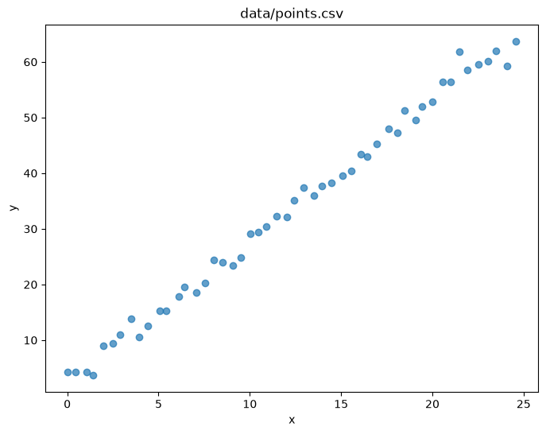
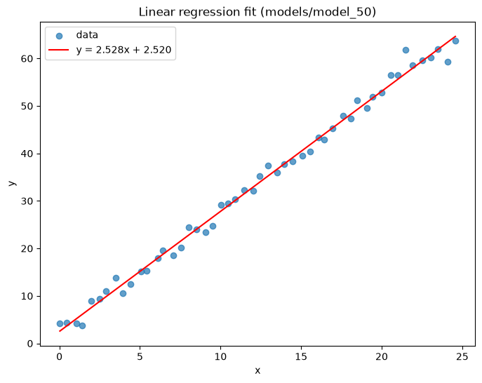

# Linear Regression in Rust

A small from-scratch implementation of simple linear regression in Rust — no ML crates, just the least-squares math written out by hand. It reads points from a CSV, fits a line `y = a*x + b`, and saves the learned coefficients to disk.

A Python/Jupyter notebook is included alongside it to visualize the data and the fitted line.

## Running it

```bash
cargo run
```
This reads `data/points.csv`, fits the line, and writes the coefficients to `models/model_50`.

Tests
```bash
cargo test
```

## Visualizing the results

The notebook at `notebooks/linear_regression.ipynb` loads `data/points.csv` and `models/model_50` and plots both.

Dependencies are managed with [uv](https://docs.astral.sh/uv/):

```bash
uv sync
uv run jupyter lab
```

**Raw data:**



**Fitted line over the data:**


